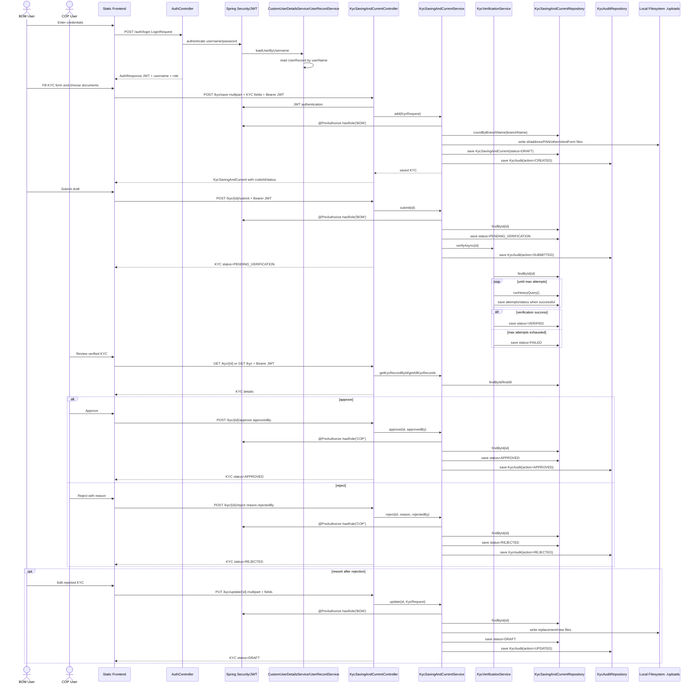
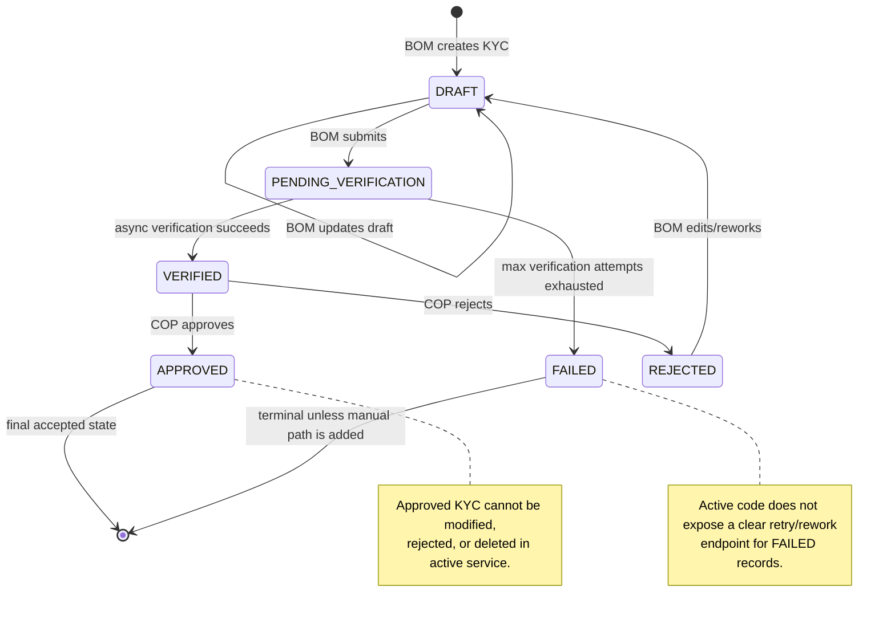
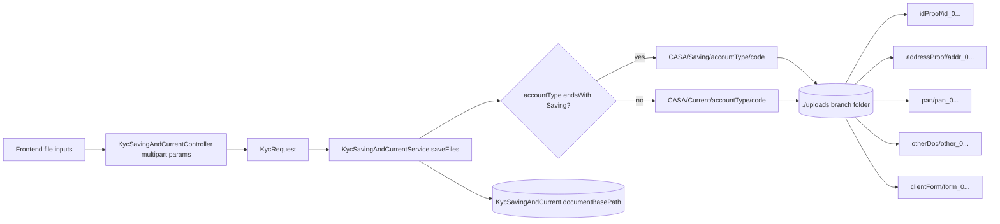
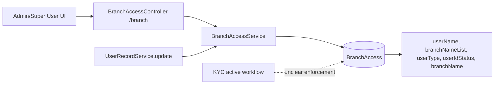
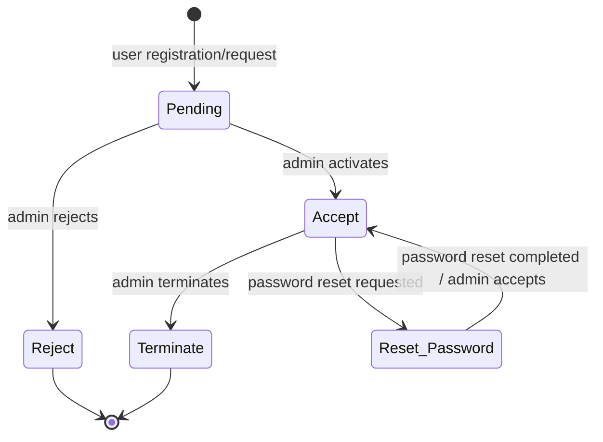

# Project Knowledge

## Backbone

The backbone of this system is the KYC lifecycle:

`BOM User -> Login -> Create KYC -> Upload Documents -> Save Draft -> Submit -> Async Verification -> Verification Result -> COP Review -> Approve/Reject -> Rework -> Final State`

This file focuses on the active backend workflow. Where code is legacy, commented out, frontend-only, or unclear, it is flagged explicitly.

## 2 Minute Explanation

This is a Spring Boot monolith for KYC account-opening operations. A BOM user logs in, creates a KYC packet for a customer, uploads required identity and account-opening documents, and saves the record as `DRAFT`. When the BOM submits it, the record moves to `PENDING_VERIFICATION` and an in-process async verifier updates it to either `VERIFIED` or `FAILED`. A COP user can only approve or reject records that are `VERIFIED`. Approval moves the KYC to `APPROVED`; rejection moves it to `REJECTED`. If a rejected record is edited by BOM, it returns to `DRAFT` for rework and can be submitted again.

The database stores KYC metadata, user records, branch access, and audit history. Documents are stored on the local filesystem under `./uploads`. Security is JWT-based with BCrypt passwords and method-level role checks. The repository contains a lot of legacy account-type-specific code and frontend calls that do not fully match the active backend.

## 5 Minute Architecture Explanation

The application is a legacy Spring Boot web application serving both backend APIs and static frontend pages. The active backend workflow is concentrated in `KycSavingAndCurrentController`, `KycSavingAndCurrentService`, `KycVerificationService`, and the JPA repositories for `KycSavingAndCurrent` and `KycAudit`.

Authentication is handled by `/auth/login`. Login accepts `LoginRequest`, authenticates through Spring Security using `CustomUserDetailsService`, loads a `UserRecord`, validates the BCrypt password, and returns `AuthResponse` containing a JWT. The JWT is later processed by `JwtAuthenticationFilter`; roles come from `UserRecord.userType` as `ROLE_<userType>`.

KYC creation is a multipart request to `/kyc/save`. The controller receives document arrays and KYC fields, creates a `KycRequest`, and calls `KycSavingAndCurrentService.add`. The service requires `ROLE_BOM`, validates Aadhaar/applicant/mobile, generates a branch-based code, stores documents on disk, creates a `KycSavingAndCurrent` entity with status `DRAFT`, saves it, and writes a `KycAudit` action `CREATED`.

Submission is `POST /kyc/{id}/submit`. The service requires `ROLE_BOM`, reads the KYC record, ensures it is `DRAFT`, validates submit readiness, sets `PENDING_VERIFICATION`, saves it, triggers `KycVerificationService.verifyAsync`, and writes audit action `SUBMITTED`.

Verification is not a message-broker event; it is in-process async execution using `@Async("kycExecutor")`. The verifier reads the record, loops until `verificationAttempts < maxVerificationAttempts`, runs a simulated heavy database query, increments attempts, and randomly marks the record `VERIFIED` or finally `FAILED`. No audit rows are created by the verifier in the active code.

COP review is exposed through `POST /kyc/{id}/approve` and `POST /kyc/{id}/reject`. Both require `ROLE_COP`. The service reads the record and only allows review if the status is `VERIFIED`. Approve sets `APPROVED`, `approvedBy`, and clears rejection fields; reject sets `REJECTED`, rejection metadata, and clears approver. Both write audit rows.

Rework is handled through the normal update path. If BOM updates a `REJECTED` record, the service resets status to `DRAFT`, clears rejection metadata, saves new files, updates fields, and writes audit action `UPDATED`. Approved records cannot be modified, rejected, or deleted.

Branch access is modeled separately with `BranchAccess` and `/branch`, but active KYC list/read endpoints do not clearly enforce branch scoping. User lifecycle is modeled through `UserRecordService`, but an active `UserRecordController` was not found in the scanned source even though frontend code still calls `/user/...` routes.

## Complete Sequence Diagram



## State Machine Diagram



## Step-by-Step Lifecycle Trace

### 1. BOM Login

- Controller: `AuthController`
- Endpoint: `POST /auth/login`
- Controller method: `login(LoginRequest loginRequest)`
- Services/components: `AuthenticationManager`, `CustomUserDetailsService`, `UserRecordService`, `JwtTokenUtil`
- Methods:
  - `CustomUserDetailsService.loadUserByUsername`
  - `UserRecordService.getUser`
  - `JwtTokenUtil.generateToken`
- DTOs: `LoginRequest`, `AuthResponse`
- Entities: `UserRecord`
- Database reads: `IUserRecordRepository.findByUserName`
- Database writes: none
- Security checks: username/password authentication through Spring Security DAO provider
- Role requirements: no prior role; `/auth/login` is permit-all
- Audit records created: none
- State transitions: none
- Uncertainty: frontend still contains older MD5/local-storage login paths calling `/user/login/...`; no active `UserRecordController` was found.

### 2. Create KYC and Upload Documents

- Controller: `KycSavingAndCurrentController`
- Endpoint: `POST /kyc/save`
- Controller method: `save(...)`
- Service: `KycSavingAndCurrentService`
- Service method: `add(KycRequest request)`
- Request object: `KycRequest` service class, not a REST DTO
- DTOs: no active KYC DTO is used by this endpoint; `dto/kyc/*` exists but is not wired into active controller methods
- Entities: `KycSavingAndCurrent`, `KycAudit`
- Database reads:
  - `KycSavingAndCurrentRepository.countByBranchName`
- Database writes:
  - `KycSavingAndCurrentRepository.save` with status `DRAFT`
  - `KycAuditRepository.save` with action `CREATED`
- File writes:
  - `./uploads/{branchName}/CASA/{Saving|Current}/{accountType}/{code}/idProof`
  - `./uploads/{branchName}/CASA/{Saving|Current}/{accountType}/{code}/addressProof`
  - `./uploads/{branchName}/CASA/{Saving|Current}/{accountType}/{code}/pan`
  - `./uploads/{branchName}/CASA/{Saving|Current}/{accountType}/{code}/otherDoc`
  - `./uploads/{branchName}/CASA/{Saving|Current}/{accountType}/{code}/clientForm`
- Security checks:
  - JWT required by `/kyc/**`
  - `@PreAuthorize("hasRole('BOM')")` on service method
- Role requirements: `BOM`
- Audit records created: `CREATED`, performed by request applicant, role `BOM`
- State transitions: none to existing record; new record starts as `DRAFT`
- Uncertainty: branch-level access is not checked in this service before creating a KYC for a branch.

### 3. Save Draft

- Controller: same as create step
- Service method: `add`
- Entity fields written:
  - account type, branch name, applicant, mobile, Aadhaar, status, remark, code, document base path
- Database writes: `KycSavingAndCurrent` inserted/updated by JPA
- Audit: `CREATED`
- State transition: `[new] -> DRAFT`
- Uncertainty: `documentBasePath` and actual save path appear inconsistent; entity stores one path shape while file saving uses a CASA/Saving/Current path.

### 4. Update Draft or Rework Rejected KYC

- Controller: `KycSavingAndCurrentController`
- Endpoint: `PUT /kyc/update/{id}`
- Controller method: `update(long id, ...)`
- Service method: `KycSavingAndCurrentService.update(long id, KycRequest request)`
- DTOs: `KycRequest`
- Entities: `KycSavingAndCurrent`, `KycAudit`
- Database reads:
  - `KycSavingAndCurrentRepository.findById`
- Database writes:
  - `KycSavingAndCurrentRepository.save`
  - `KycAuditRepository.save` with action `UPDATED`
- File writes: same document categories as create
- Security checks:
  - JWT required
  - `@PreAuthorize("hasRole('BOM')")`
- Role requirements: `BOM`
- Audit records created: `UPDATED`
- State transitions:
  - `DRAFT -> DRAFT` for ordinary edit
  - `REJECTED -> DRAFT` for rework
- Guardrails:
  - `APPROVED` cannot be modified
  - rejected metadata is cleared on rework
- Uncertainty: the active update always calls `saveFiles`; behavior when partial file arrays are missing should be tested.

### 5. Submit

- Controller: `KycSavingAndCurrentController`
- Endpoint: `POST /kyc/{id}/submit`
- Controller method: `submit(long id)`
- Service method: `KycSavingAndCurrentService.submit(long id)`
- DTOs: none
- Entities: `KycSavingAndCurrent`, `KycAudit`
- Database reads:
  - `KycSavingAndCurrentRepository.findById`
- Database writes:
  - `KycSavingAndCurrentRepository.save` with status `PENDING_VERIFICATION`
  - `KycAuditRepository.save` with action `SUBMITTED`
- Security checks:
  - JWT required
  - `@PreAuthorize("hasRole('BOM')")`
- Role requirements: `BOM`
- Audit records created: `SUBMITTED`
- State transition: `DRAFT -> PENDING_VERIFICATION`
- Guardrails:
  - only `DRAFT` can be submitted
  - record must have Aadhaar and applicant name

### 6. Async Verification

- Triggering service method: `KycSavingAndCurrentService.submit`
- Async service: `KycVerificationService`
- Async method: `verifyAsync(Long kycId)`
- Async executor: `kycExecutor` from `AsyncConfig`
- DTOs: none
- Entities: `KycSavingAndCurrent`
- Database reads:
  - `KycSavingAndCurrentRepository.findById`
  - `KycSavingAndCurrentRepository.runHeavyQuery`
- Database writes:
  - increments/sets verification attempts
  - saves `VERIFIED` on success
  - saves `FAILED` after max attempts
- Security checks:
  - none inside async method
  - authorization happens before trigger at submit
- Role requirements: none inside async worker
- Audit records created: none in active code
- State transitions:
  - `PENDING_VERIFICATION -> VERIFIED`
  - `PENDING_VERIFICATION -> FAILED`
- Uncertainty: current verification result is randomized and does not call Zoop; it appears to be a placeholder/simulation.

### 7. Verification Result

- Controller: no callback endpoint
- Result is persisted by async worker
- Database reads by callers:
  - `GET /kyc/{id}` via `getKycRecordById`
  - `GET /kyc` via `getAllKycRecords`
- Database writes: performed by async worker
- Security checks:
  - read endpoints require JWT through `/kyc/**`
  - no service-level role restriction found on `get` or `getAll`
- Role requirements: authenticated user; exact role not enforced in service method
- Audit records created: none
- State transitions:
  - success: `PENDING_VERIFICATION -> VERIFIED`
  - failure: `PENDING_VERIFICATION -> FAILED`
- Uncertainty: no explicit notification, polling contract, or audit trail for verification completion was found.

### 8. COP Review

- Controller: `KycSavingAndCurrentController`
- Review read endpoints:
  - `GET /kyc/{id}`
  - `GET /kyc`
  - `GET /kyc/{id}/audit`
- Service methods:
  - `getKycRecordById`
  - `getAllKycRecords`
  - `getAuditHistory`
- Entities: `KycSavingAndCurrent`, `KycAudit`
- Database reads:
  - `KycSavingAndCurrentRepository.findById`
  - `KycSavingAndCurrentRepository.findAll`
  - `KycAuditRepository.findByKycIdOrderByTimestampAsc`
- Database writes: none during read
- Security checks: JWT required; no method-level COP-only restriction on reads found
- Role requirements: authenticated user in active backend
- Audit records created: none for reads
- State transitions: none
- Uncertainty: branch-scoped review is not clearly enforced in active read path.

### 9. Approve

- Controller: `KycSavingAndCurrentController`
- Endpoint: `POST /kyc/{id}/approve`
- Controller method: `approve(long id, String approvedBy)`
- Service method: `KycSavingAndCurrentService.approve(long id, String approvedBy)`
- DTOs: none; `approvedBy` is a request parameter
- Entities: `KycSavingAndCurrent`, `KycAudit`
- Database reads:
  - `KycSavingAndCurrentRepository.findById`
- Database writes:
  - `KycSavingAndCurrentRepository.save` with status `APPROVED`
  - `KycAuditRepository.save` with action `APPROVED`
- Security checks:
  - JWT required
  - `@PreAuthorize("hasRole('COP')")`
- Role requirements: `COP`
- Audit records created: `APPROVED`
- State transition: `VERIFIED -> APPROVED`
- Guardrails:
  - already approved records cannot be approved again
  - only `VERIFIED` records can be approved
- Uncertainty: frontend and repository queries refer to `COPs`, while active service requires role `COP`.

### 10. Reject

- Controller: `KycSavingAndCurrentController`
- Endpoint: `POST /kyc/{id}/reject`
- Controller method: `reject(long id, String reason, String rejectedBy)`
- Service method: `KycSavingAndCurrentService.reject(long id, String reason, String rejectedBy)`
- DTOs: none; `reason` and `rejectedBy` are request parameters
- Entities: `KycSavingAndCurrent`, `KycAudit`
- Database reads:
  - `KycSavingAndCurrentRepository.findById`
- Database writes:
  - `KycSavingAndCurrentRepository.save` with status `REJECTED`
  - `KycAuditRepository.save` with action `REJECTED`
- Security checks:
  - JWT required
  - `@PreAuthorize("hasRole('COP')")`
- Role requirements: `COP`
- Audit records created: `REJECTED`, remark stores rejection reason
- State transition: `VERIFIED -> REJECTED`
- Guardrails:
  - approved records cannot be rejected
  - only `VERIFIED` records can be rejected

### 11. Rework

- Controller: `KycSavingAndCurrentController`
- Endpoint: `PUT /kyc/update/{id}`
- Service method: `update`
- Security: `ROLE_BOM`
- Database reads: `findById`
- Database writes: record save and audit save
- File writes: replacement document upload directories
- Audit records: `UPDATED`
- State transition: `REJECTED -> DRAFT`
- Final next step: BOM must resubmit to restart verification
- Uncertainty: there is no specific "send back for rework" endpoint in active backend; rework is inferred from update behavior for rejected records.

### 12. Final State

- Approved final state: `APPROVED`
- Failed final state: `FAILED`, based on active async worker
- Rejected non-final state: `REJECTED`, because BOM update can move it back to `DRAFT`
- Database reads:
  - `GET /kyc/{id}`
  - `GET /kyc/{id}/audit`
- Database writes: none after terminal state unless rework applies
- Audit:
  - `APPROVED` or `REJECTED` exists
  - `FAILED` currently has no audit record

## Document Upload Architecture



Key points:

- Files are not stored in the active database entity as blobs.
- File content is written directly to local disk.
- KYC metadata stores `documentBasePath`.
- Legacy account-specific services show old paths for joint/non-individual documents, but those services are commented out.
- No cloud/object storage was found.
- No checksum, malware scan, content-type enforcement, filename preservation, or retention policy was found in active service code.

## Async Verification Architecture

```mermaid
flowchart TD
    SUBMIT[POST /kyc/{id}/submit] --> SVC[KycSavingAndCurrentService.submit]
    SVC --> DB1[(Save PENDING_VERIFICATION)]
    SVC --> ASYNC[KycVerificationService.verifyAsync]
    ASYNC --> EXEC[kycExecutor ThreadPoolTaskExecutor]
    EXEC --> READ[(findById)]
    READ --> LOOP{attempts < max?}
    LOOP --> HEAVY[runHeavyQuery pg_sleep]
    HEAVY --> RESULT{random valid?}
    RESULT -->|yes| VERIFIED[(save VERIFIED)]
    RESULT -->|no| LOOP
    LOOP -->|exhausted| FAILED[(save FAILED)]
```

Key points:

- It is in-process async, not queue-based.
- Executor settings are static: core 15, max 65, queue 70.
- Verification is currently simulated/randomized.
- No retry scheduler, dead-lettering, idempotency token, or completion audit was found.
- Async method updates the same KYC table directly.

## Security Architecture

```mermaid
flowchart TD
    LOGIN[/POST /auth/login/] --> AUTH[AuthenticationManager]
    AUTH --> UDS[CustomUserDetailsService]
    UDS --> USER[(UserRecord)]
    AUTH --> JWT[JwtTokenUtil creates JWT]
    JWT --> CLIENT[Client stores/sends Bearer token]
    CLIENT --> FILTER[JwtAuthenticationFilter]
    FILTER --> UDS2[Reload UserDetails]
    FILTER --> CTL[Protected Controller]
    CTL --> SVC[Service method]
    SVC --> PREAUTH[@PreAuthorize role checks]

    PREAUTH --> BOM[hasRole BOM for create/update/submit/delete]
    PREAUTH --> COP[hasRole COP for approve/reject]
```

Important controls:

- JWT stateless sessions.
- BCrypt password encoder.
- Static pages are public.
- `/kyc/**` requires authentication.
- KYC lifecycle mutation checks are implemented at service method level.

Important uncertainties/risks:

- `COP` vs `COPs` role naming mismatch.
- Frontend still contains legacy MD5 login logic and `/user/...` calls.
- Branch authorization is modeled separately but not clearly enforced on active KYC endpoints.
- Actuator exposure is configured as `*`.
- JWT secret is stored in application properties.

## Branch Access Architecture



Active backend:

- Controller: `BranchAccessController`
- Service: `BranchAccessService`
- Entity: `BranchAccess`
- DTOs: `BranchAccessRequest`, `BranchAccessResponse`
- Routes:
  - `POST /branch`
  - `PUT /branch/{id}`
  - `GET /branch`
  - `GET /branch/{id}`
  - `GET /branch/user/{username}`
  - `DELETE /branch/{id}`

Workflow relevance:

- Branch access should determine which branch KYC records a user can see or act on.
- Active KYC reads/writes do not clearly consult `BranchAccessService`.
- Legacy/commented KYC services had branch-filtered methods using branch access lists.

## User Lifecycle Architecture



Entities and services:

- Entity: `UserRecord`
- Service: `UserRecordService`
- Repository: `IUserRecordRepository`
- DTOs: `UserRecordRequest`, `UserRecordResponse`, `UserRecordCountResponse`, `UserPasswordResetRequest`
- Status strings: `Pending`, `Accept`, `Reject`, `Terminate`, `Reset_Password`

Uncertainty:

- No active `UserRecordController` was found in the scanned controller package.
- Frontend `super_user.js` and `index.js` call many `/user/...` endpoints that do not appear active in source.
- Login in active backend does not explicitly block non-`Accept` statuses in `CustomUserDetailsService`.

## Failure Scenarios

- Login fails because user does not exist.
- Login fails because password hash does not match.
- Login succeeds for an inactive user if status is not checked elsewhere.
- JWT expires after configured expiration.
- JWT role claim/user role mismatches method-level role requirement.
- BOM cannot save if Aadhaar is not 12 digits.
- BOM cannot save if applicant is missing.
- BOM cannot save if mobile number is not 10 digits.
- Document upload fails because `./uploads` is not writable.
- Document upload succeeds partially but database save fails, leaving orphan files.
- Database save succeeds but audit save fails.
- Generated code conflicts under concurrent creates because it is based on branch count.
- KYC submit fails if record does not exist.
- KYC submit fails if record is not `DRAFT`.
- Async verification never runs because executor is saturated.
- Async verification fails because database connection pool is exhausted.
- Async verification marks record `FAILED` after max attempts.
- Async verification result is non-deterministic because current logic uses randomness.
- COP cannot approve a record still in `PENDING_VERIFICATION`.
- COP cannot reject a record still in `PENDING_VERIFICATION`.
- COP cannot approve with role `COPs` if backend requires `COP`.
- Approved record cannot be updated.
- Approved record cannot be rejected.
- Approved record cannot be deleted.
- Rejected record can be reworked but may overwrite or duplicate files.
- Failed record has no clear active rework/retry path.
- Branch access list is stale or inconsistent with `UserRecord.branchName`.
- KYC read endpoints expose records across branches to any authenticated user.
- Frontend calls legacy endpoints that active backend does not expose.
- Zoop frontend calls fail because Zoop backend controller is commented and `zoop.enabled=false`.

## Security Review

Strengths:

- BCrypt password hashing is configured.
- JWT-based stateless authentication is present.
- KYC mutation operations use method-level role checks.
- Approved records are protected from update/delete/reject in service logic.
- Audit rows exist for create, update, submit, approve, reject, and delete.

Risks:

- Role naming is inconsistent: `COP`, `COPs`, and possibly `Super User`.
- Active login does not visibly enforce `UserRecord.userIdStatus == Accept`.
- Static frontend still contains legacy MD5 password handling references.
- Branch-level authorization is not clearly enforced on active `/kyc` operations.
- `GET /kyc` appears available to any authenticated user.
- `GET /kyc/{id}/audit` appears available to any authenticated user.
- `management.endpoints.web.exposure.include=*` exposes all actuator endpoints.
- JWT secret is hardcoded in `application.properties`.
- File upload does not visibly enforce file type, size, virus scanning, or content validation server-side.
- Uploaded file paths include user-controlled branch/account strings without visible canonicalization.
- Audit performed-by values are sometimes request parameters or hardcoded strings rather than authenticated principal names.
- Approve/reject accept `approvedBy`/`rejectedBy` as request parameters instead of deriving from authenticated user.

## Design Weaknesses

- Active backend and frontend are misaligned.
- The repository contains large amounts of commented legacy code.
- Account-type-specific modules exist as entities and frontend forms, but active controllers/services are mostly disabled.
- KYC DTOs exist but active multipart endpoints use request params plus `KycRequest`.
- Branch access is modeled but not clearly enforced in active KYC service methods.
- Verification is simulated/random instead of deterministic or external-provider based.
- Verification completion has no audit record.
- File writes and database writes are not transactional as one unit.
- Local filesystem storage makes scaling and backup harder.
- Generated KYC code is count-based and may race under concurrent requests.
- No database migration framework was found.
- `ddl-auto=update` makes schema ownership implicit.
- User lifecycle is service-backed but lacks an active controller in source.
- Role/status values are strings in several places instead of normalized enums.
- There is no workflow engine; state transitions are hand-coded in services.
- No scheduled recovery job exists for stuck `PENDING_VERIFICATION` records.
- No message queue isolates verification workload from request lifecycle.

## Interview Questions

1. What is the main business purpose of this system?
2. What are the active KYC states?
3. Which role creates KYC records?
4. Which role approves KYC records?
5. What status must a KYC have before COP approval?
6. What happens when BOM submits a draft?
7. What triggers async verification?
8. Is verification broker-based or in-process?
9. What table stores active KYC metadata?
10. What table stores audit history?
11. Where are documents stored?
12. What fields identify a KYC document folder?
13. What audit action is created on KYC creation?
14. What audit action is created on submit?
15. Does async verification create an audit row?
16. What is the final accepted KYC state?
17. Can approved KYC be edited?
18. Can approved KYC be rejected?
19. What happens when BOM edits a rejected record?
20. What status does a failed verification record enter?
21. Is there a clear retry path for `FAILED` records?
22. Which controller handles active KYC endpoints?
23. Which service owns active KYC transitions?
24. Which service owns async verification?
25. Which repository is used for active KYC records?
26. Which repository is used for audit records?
27. What DTO is used for login?
28. What object is used for active KYC multipart save?
29. Are active KYC DTOs wired into the controller?
30. How is the user's role derived?
31. What password encoder is configured?
32. What endpoint issues JWTs?
33. Which filter authenticates JWT requests?
34. What method-level security annotation protects BOM actions?
35. What method-level security annotation protects COP actions?
36. What role mismatch risk exists in the codebase?
37. Is branch-level access enforced in active KYC reads?
38. What entity models branch access?
39. What entity models users?
40. What user lifecycle statuses exist?
41. Was an active user controller found?
42. What third-party KYC integration exists?
43. Is Zoop enabled in current configuration?
44. What legacy internal KYC integration is referenced?
45. What actuator exposure risk exists?
46. Why is count-based KYC code generation risky?
47. Why is local filesystem document storage operationally sensitive?
48. Why is `ddl-auto=update` risky?
49. Which parts of the codebase appear legacy or commented out?
50. Which components deserve deep analysis before modernization?

## Uncertainty Register

- Active frontend compatibility is uncertain because many frontend calls target legacy endpoints.
- Active non-saving/current account flows are uncertain because controllers/services are mostly commented out.
- User administration API availability is uncertain because service and frontend exist but active controller was not found.
- Zoop integration availability is uncertain because service is conditional and controller is commented.
- Branch authorization behavior is uncertain because branch access exists but active KYC service does not visibly enforce it.
- Failed verification business handling is uncertain because no explicit retry/rework flow was found.
